For one reason or another[^1], I've started trying to learn Swedish in my spare time, as one does. 
Although it is at times quite similar to English, the peculiarities of Swedish start to show up right at its alphabet - there are **9 vowels** in _Svenska_, as opposed to the five that english (or any latin-derived language) speakers are used to. 

Now, what does that have to do with Windows keyboard layouts?

Well, it turns out that one of those 9 aforementioned vowels is **å** - a character that has no simple input on both keyboard layouts I use (US and Brazil ABNT2). And since I only needed two extra characters (for uppercase Å/lowercase å), I definitely couldn't be bothered with checking out whatever the common keyboard layout for swedish might be, even though it does not seem possible, from Windows configuration options alone, to customize a given keyboard layout to add a character or two as a given keypress combination.

Thankfully, though, I stumbled on a tweet[^2] that mentioned an actual Microsoft tool that lets one do just that!
One can get the aptly-named Microsoft Keyboard Layout Creator (MSKLC for short from here on) from [https://www.microsoft.com/en-us/download/confirmation.aspx?id=22339](https://www.microsoft.com/en-us/download/confirmation.aspx?id=22339)

After downloading the installer (MSKLC.exe) and installing the tool (open the installer, click on setup and then follow the usual Next -> Next -> Next -> Finish installation ritual), one can find and open the Keyboard Layout Creator from the Start Menu, and then we can get started creating our customized Swenglish Keyboard Layout:

## 1 - Customizing the Layout

Upon starting the Layout Creator, it opens an empty layout to work with. Since we only want to change a couple keys, we can load an existing keyboard layout to speed things up, and go from there:

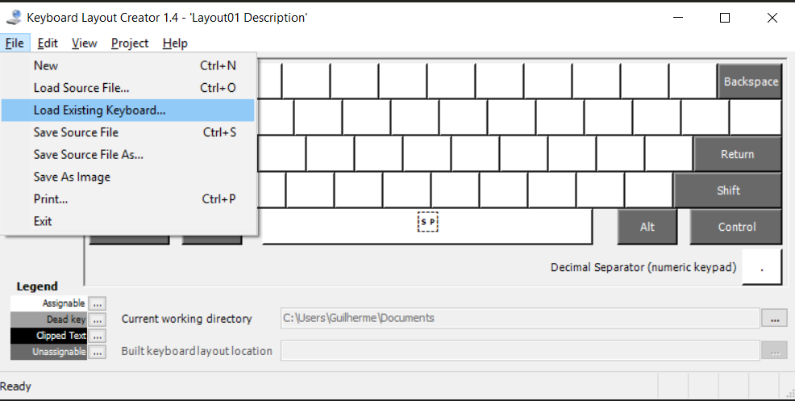

(An Keyboard editor it does not have keyboard shortcuts for every action? I want my money back)

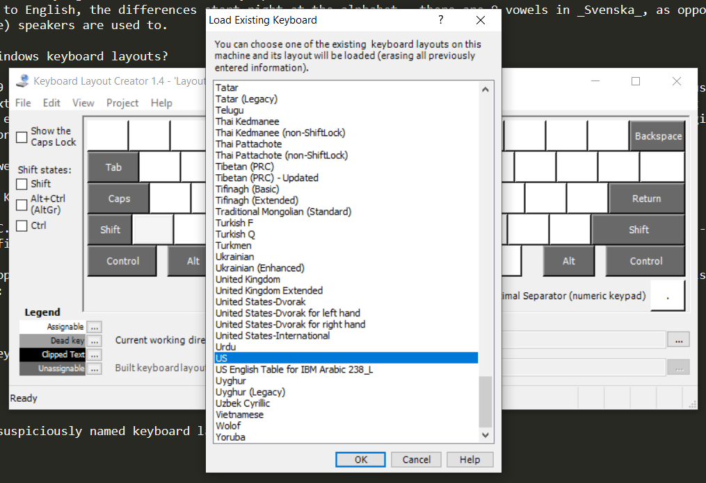

For this example, we'll be using the 'US' keyboard as the initial layout.

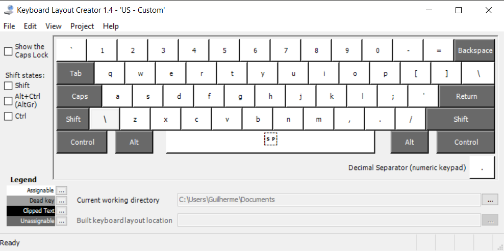

Et voilà!

---

Now, using this tool is quite straightforward: 

 - Use the toggles on the left side to show the keyboard state with Shift/Ctrl/AltGr pressed. For this example, we'll bind **å** to **AltGr + a**

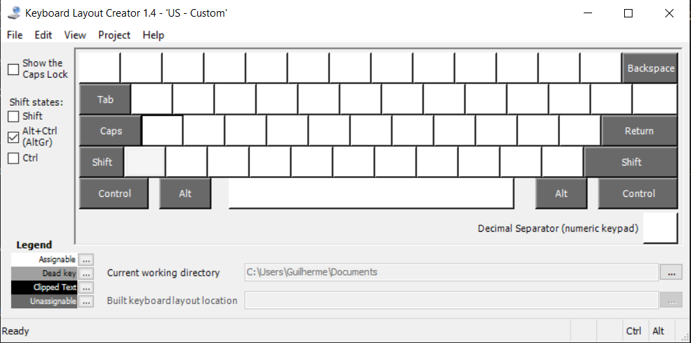

- Click on the key to which you want to assign a given character.

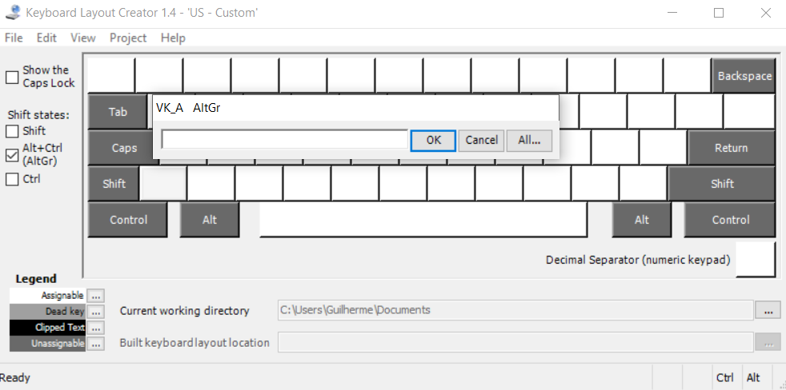

 - Copy the desired character to the textbox on the popup (from a text with the desired character on it, or using the ubiquitous [Character Map](https://en.wikipedia.org/wiki/Character_Map_(Windows))) and click OK.

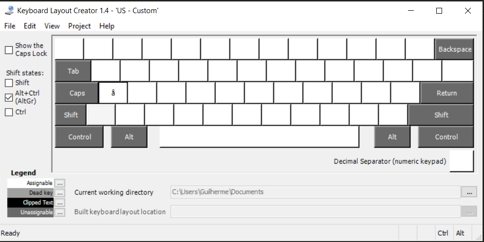

 - All done!

 Adding Å as AltGr+Shift+a is just as simple - we just need to toggle both the AltGr and Shift states and remember to add the uppercase letter:

## 2 - Naming, saving, and installing the layout

After customizing the keyboard layout to our hearts' contents, we'll need to save an installer in order to add it to a computer.

To do so, simply choose the menu option **Project -> Build DLL and Setup Package**.

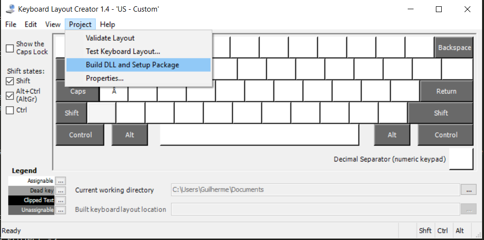

If you haven't already done so (via the **Project -> Properties** menu), the tool will alert you to change name and name and description for the new layout. Click *Yes* on the popup to get to the Properties screen:

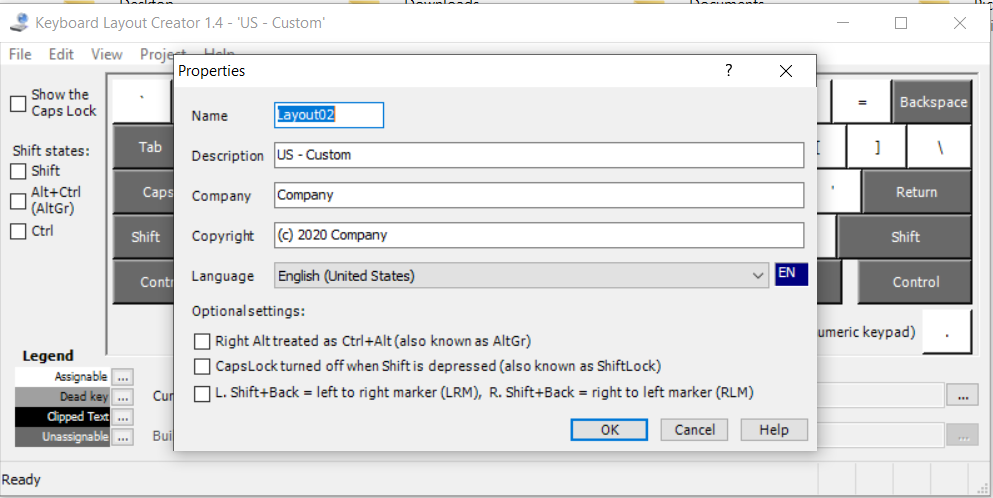

The important fields here are **Name** and **Description**: 

**Name** is a short name that will identify our layout within Windows, and as such may not have special characters or be too long.

**Description** is the name that shows up on the language switcher (see below) - since it shows only a small window you may want to describe your customization at the beginning of the field so that it's easier to identify your layout

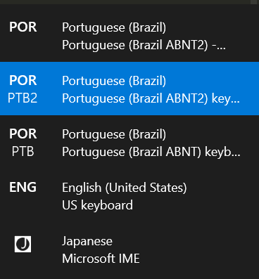

After saving the layout's properties MSKLC will build an installer - by default, it will be located at C:\Users\USER\Documents\[layout name]

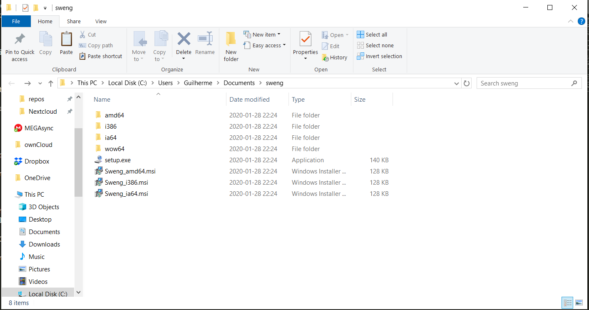

If you want to share the created layout between computers (say, in a corporate setting perhaps), just copy the contents of this folder and run the installer. 

To install the layout to the current machine, simply run the setup.exe executable and reboot the machine[^3] to have it available.

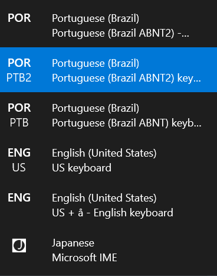

Windows language switcher after installing the new layout

## 3 - Extra - Dead keys

Since Swedish only has one letter with an uncommon diacritic above it, we could get by simply mapping the pair of lowercase/uppercase letters to a modifier+key combination. If we had to add a diacritic that might affect multiple letters, MSKLC provides the option to create a [Dead key](https://en.wikipedia.org/wiki/Dead_key) which is a letter used to attach a diacritic to a base letter (in the brazilian ABNT layouts, for example, **´/`**, **~/^** and **¨** are dead keys). 
For those not used to the concept, creating a dead key for '°' means we'd be able to create å/Å by typing the combination for '°' and then the letter a/A.

To add ° as a diacritic mapped by AltGr+e (which maps to the '°' symbol on a portuguese keyboard layout), for example:

1. Load the keyboard layout and select the key to map in the same way as we've done before. Click 'All...' on the popup instead of 'OK' to bring up the full options for the key:

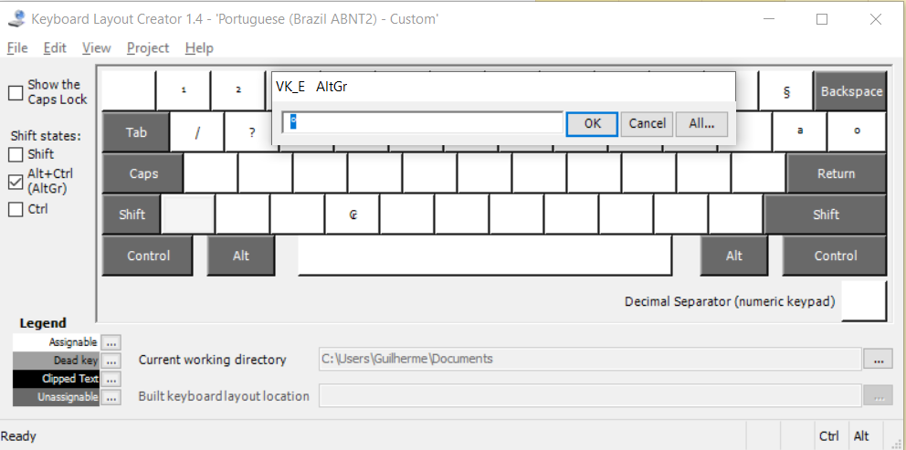

On the full options panel, toggle the 'Dead Key View' and then toggle 'Dead Key?' for the desired shift states (in our case, ctrl+alt+<key>, which amounts to AltGr+<key>) to enable further options.

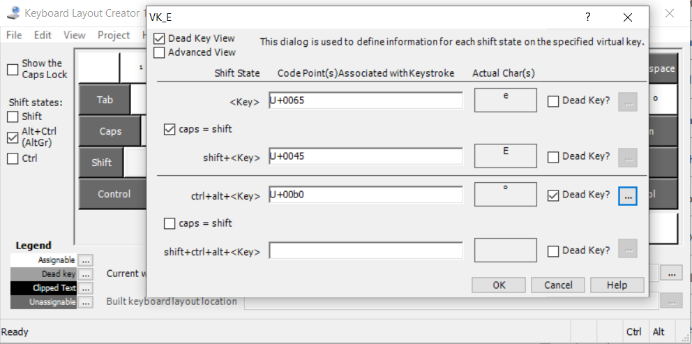
Click on the '...' button that was just enable to open the dead key definition table.

For each composite character we want to enable, we'll need to write the base character (in our case, 'a' or 'A') on the 'Base (code point) column' and the composite character (å or Å) on the 'Composite (code point)' column.

After filling lines for both å and Å, we should have a table filled like this.

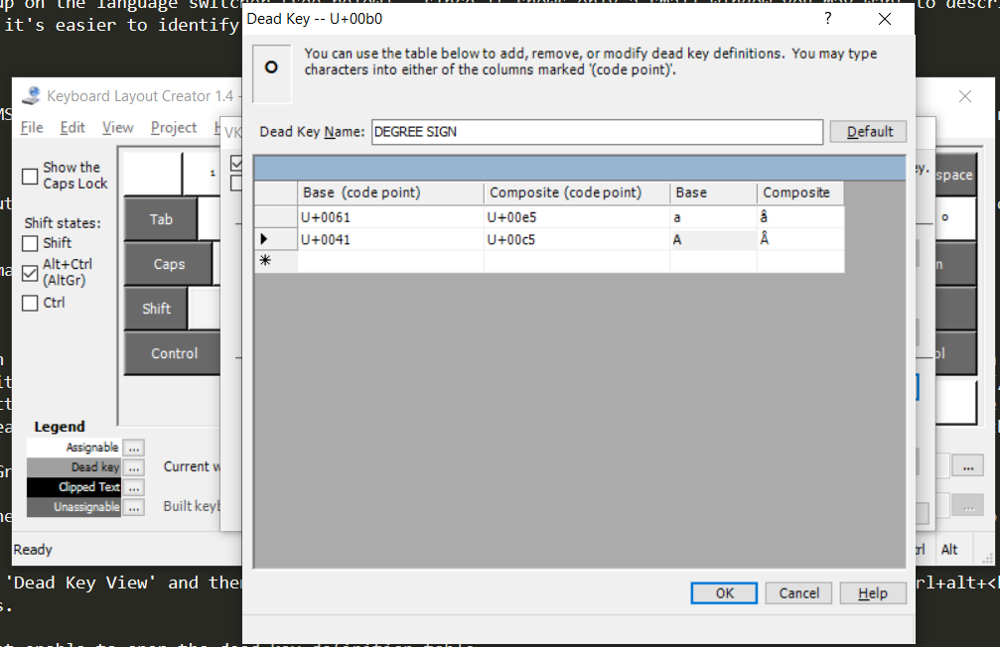

Click OK on the table popup, OK again on the previous key edition popup, and we're done! Now all we would need to do is to build the layout installer and install the keyboard layout as we did before.

[^1]: In no particular order, they include having fiinished my last package of [liquorice](), visiting friends who moved to Sweden, being curious about trying out surströmming, and being able to understand a larger part of the jokes on the [SSSS]() comment section

[^2]: I don't have the link to that particular tweet, but it's the right combination of Windows Management and random IT stuff to make me believe it was an answer in a [SwiftOnSecurity](https://twitter.com/SwiftOnSecurity) thread, so go follow Tay if you haven't yet.

[^3]: It's a windows tool being used to install a windows feature, we'd _obviously_ never be able to get to the end of the instructions without at least one reboot.
