Este texto é o primeiro de uma série tentativa de tópicos relacionados à segurança - inicialmente no desenvolvimento e manutenção de aplicações web - a fim de consolidar os conhecimentos adquiridos na área ao longo de alguns anos de estudo e desenvolvimento de aplicações deste tipo.

Iniciamos por algumas questões sobre HTTPS que, devido ao quão ubíquo o uso (e a recomendação de uso) de HTTPS em detrimento do HTTP se tornou, usualmente são relevadas durante as discussões sobre o assunto.

Com alguma sorte, este texto deveria ser útil também para outros procurando informações em português[^1] sobre o assunto - porém alguns links e referências ao longo do texto poderão estar em inglês.

O artigo está estruturado com base no [5W1H](https://pt.wikipedia.org/wiki/5WH), uma forma de listar perguntas a serem feitas para compreender um fato, história ou situação (Who?/What?/Where?/When?/Why?/How? em inglês, ou Quem?/Quê?/Quando?/Onde?/Por quê?/Como? em português), a fim de apresentar os comos e porquês do uso de HTTPS.

## 1 - O que é HTTPS?
HTTPS é a sigla para Hyper Text Transfer Protocol, Secure - um protocolo que envelopa a comunicação via HTTP de forma criptografada utilizando um protocolo TLS ou SSL, com um certificado apresentado pelo servidor HTTPS ao qual se está conectando. 
(Por completeza: HTTP é o protocolo padrão utilizado para transferência de dados na Web - entre um browser e o servidor que hospeda um site[^2] ou entre aplicações e APIs na Web ou mesmo em redes internas).

Embora mais detalhes sobre como esta criptografia é realizada serão apresentados em outro momento, esta descrição basta para apresentar as motivações para utilizar HTTPS na comunicação entre um cliente e um servidor (em oposição a simplesmente utilizar HTTP), e como e quando fazer isso.

## 2 - Por que utilizar HTTPS?

Resumidamente, o uso do protocolo HTTPS na comunicação cliente-servidor garante três objetivos:

  - Autenticidade: Durante o estabelecimento da conexão HTTPS, o servidor apresenta um certificado, que é atrelado a um ou mais nomes de domínio específicos. Com isso, uma vez que o cliente (vulgo browser) verifica que o certificado apresentado por um servidor para um domínio é válido, verifica por tabela que o servidor a que está se conectando é o autêntico responsável por servir o conteúdo referente àquele domínio.
  - Integridade: Dado que o certificado apresentado pelo servidor é autêntico, não deveria ser possível[^3] a um terceiro alterar o conteúdo da comunicação entre o cliente e o servidor de forma indetectável por estes.
  - Confidencialidade: Dado que o certificado apresentado pelo servidor é autêntico, não deveria ser possível a um terceiro ler o conteúdo não criptografado da comunicação entre estes.

Note-se que esses objetivos são alcançados supondo que o cliente consiga validar que o tal certificado apresentado pelo servidor é válido e autêntico, o que leva à próxima questão:

## 3 - Quem vai saber dizer se um certificado é autêntico?

A validação de um certificado pelo browser pode ocorrer de duas formas:

 - Adicionando (ou "instalando") diretamente o certificado a um rol de certificados "confiáveis" do cliente. Isto pode ser feito com o certificado sendo transmitido ao cliente previamente por uma via segura que não a conexão HTTPS com o servidor, e é mais comum para servidores que fazem parte de uma rede interna (p.ex. em uma empresa), na qual a quantidade de clientes que vão acessar o servidor, e portanto precisam receber e instalar o certificado, é limitada.
 - Confiando em um certificado-raiz: Um certificado TLS atrelado a um domínio é normalmente emitido por uma entidade denominada Autoridade Certificadora (CA na sigla em inglês) - que verifica que o certificado para um determinado domínio foi solicitado por um responsável por este. O certificado gerado é assinado pela CA utilizando o certificado _dela_, que por sua vez foi gerado e assinado como sendo válido por uma outra CA, e assim por diante até chegar em uma entre um número de CAs "raiz", cujos certificados são validados por meios externos a essa árvore de CAs por fabricantes de software, que por sua vez adicionam estes certificados raiz como confiáveis pelos seus browsers/SOs/outros clientes.

Por exemplo, o certificado para https://www.bb.com.br tem uma cadeia com três certificados, em que o certificado para "USERTrust RSA Certification Authority" corresponde ao certificado raiz.

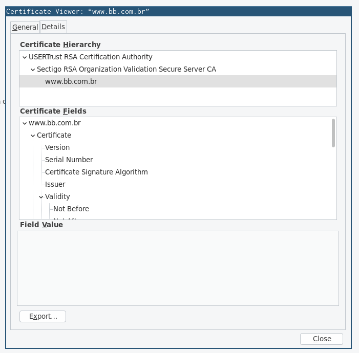

Vale explicitar também que a validação descrita acima diz respeito apenas à validação da _autenticidade_ do certificado, mas o cliente usualmente valida outras informações do mesmo, como:

  - *Data de Validade*: Os certificados utilizados tem um tempo de vida que variam entre alguns meses e um a dois anos. Via de regra, para evitar problemas em caso de vazamento de dados privados referentes ao certificado, é sugerido o uso de certificados com tempo de vida mais curto aliados a formas de facilitar ou automatizar sua substituição.

  - *Domínio*: Certificados são atrelados a um domínio (e.g. victal.eti.br) e um ou mais subdomínios do mesmo, de forma que (por definição) é necessário que o cliente verifique que o domínio para o qual o certificado é válido é o mesmo que está sendo acessado.

Também é possível, juntando estas duas formas de validação, adicionar diretamente um certificado não verificado através da hierarquia normal de certificados-raiz à lista de certificados confiáveis a fim de confiar nos certificados geraos e assinados a partir dele. Isto é algo mais plausível em redes internas corporativas com um número significativo de serviços web - por ser mais simples adicionar um certificado raiz às máquinas dos colaboradores conectadas à rede do que os certificados para todos os serviços disponíveis (certificados que teriam que ser re-adicionados periodicamente conforme os anteriores expirassem).

## 4 - Onde e quando usar HTTPS?

Sempre (que possível). 

Com o advento de certificados TLS gratuitos em massa (via [Let's Encrypt](https://letsencrypt.org/) e outros CAs), [melhorias de performance significativas](https://www.httpvshttps.com) e mesmo engines de busca dando prioridade a resultados em HTTPS a páginas em HTTP, além dos ganhos de segurança, não deveria haver motivo para deixar de utilizar HTTPS em todo servidor Web acessível na Internet.

Em casos que o servidor lida com dados sensíveis (como logins/senhas ou outros dados de autenticação, ou dados acessíveis apenas a usuários cadastrados/administrativos), é imediato chegar à conclusão de que se precisa utilizar HTTPS por conta da confidencialidade dos dados.

Para serviços (ou partes de um serviço) que não lidam com este tipo de dado porém, ainda é relevante o uso de HTTPS pelas suas características de Autenticidade e Integridade de dados. Conexões HTTP são trivialmente suscetíveis a ataques de MITM[^4], em que um terceiro sistema altera o conteúdo das mensagens trafegadas entre o cliente e o servidor para, por exemplo:
  - Substituir arquivos para download inócuos por versões com malware;
  - Adicionar scripts para injeção de conteúdo que podem ir de simples propagandas (algo que até provedores de internet chegam a fazer) a mineradores de criptomoeda ou ataques de CSRF a outras páginas (como a [interface de administração do seu roteador](https://nakedsecurity.sophos.com/2012/10/01/hacked-routers-brazil-vb2012/)).


## 5 - Como usar HTTPS para servir conteúdo?

Agora que nos convencemos(?) de que é necessário utilizar HTTPS quando disponibilizando conteúdo na Web, vejamos como fazê-lo. Neste caso, o certificado será gerado via Let's Encrypt, e instalado em um servidor Apache 2 ao qual se tem acesso remoto. Para configuração em outras situações (como um serviço de hospedagem que fornece apenas uma interface de admin via Web, por exemplo), pode ser necessário consultar a documentação do serviço de administração ou hosting para realizar a instalação do certificado.

### 5.1 - Geração de certificados

Para geração do certificado, o Let's Encrypt disponibiliza o [Certbot](https://certbot.eff.org), uma ferramenta de linha de comando para geração de certificados TLS e, em alguns casos, configuração automática do servidor Web. 

Instruções de instalação e uso do Certbot específicas por sistema operacional e Servidor Web podem ser encontradas [aqui](https://certbot.eff.org/instructions) (em inglês) - e caso a combinação de SO e Web server utilizados se encaixe em uma das configurações apresentadas no site, recomenda-se utilizá-la, para obter funcionalidades extras como atualização automática do certbot ou renovação automática de certificados.

Caso não seja possível seguir as instruções descritas na documentação oficial, os passos a seguir deveriam ser o suficiente para gerar um par de certificados para os domínios desejados - o único pré-requisito é uma máquina com Linux instalado para a execução do certbot.

 - Baixe a última versão do certbot-auto, um wrapper para o certbot que trata da instalação/atualização da ferramenta propriamente dita, copie-a para uma pasta que faça parte do `$PATH` (por conveniência), torne executável com `chmod` e execute-a sem argumentos para realizar o processo de instalação.

```
    wget https://dl.eff.org/certbot-auto
    sudo mv certbot-auto /usr/local/bin/certbot-auto
    sudo chown root /usr/local/bin/certbot-auto
    sudo chmod 0755 /usr/local/bin/certbot-auto
    certbot-auto
```

Para validar que o requisitante do certificado é responsável pelo respectivo domínio, o Certbot utiliza uma de duas verificações possíveis, à escolha do usuário:

 - DNS: Em que é solicitado ao requisitante adicionar um registro DNS do tipo TXT para um subdomínio específico do domínio solicitado, com um valor gerado dinamicamente;
 - HTTP: Em que é solicitada ao requisitante a inclusão de um conteúdo gerado dinamicamente em um path também dinamicamente gerado (iniciando em /.well-known/acme-challenge) no servidor Web acessível através do nome de domínio para o qual o certificado está sendo gerado.

Restrições na forma de validação ocorrem apenas para certificados _wildcard_, válidos para todos os subdomínios de um domínio (e.g. o certificado _wildcard_ para `*.example.org` vale para todo subdomínio qualquercoisa.example.org). Como não é possível listar todos os subdomínios válidos de um domínio a fim de validá-los via HTTP, a validação deve ser feita via DNS.

Desta forma, para solicitar a geração de certificados para um ou mais domínios, basta executar:

```
certbot-auto certonly --manual -d [domínio] [-d um-subdomínio -d outro-subdomínio etc.] --preferred-challenges [dns ou http]
```
e seguir os passos no terminal.

Por exemplo, para gerar um certificado para os domínios 'victal.eti.br' e 'www.victal.eti.br' (i.e. para este site), temos a seguinte série de passos: 

1 - Inicialmente, é requisitado um email para contato (em caso de algum problema que gere a invalidação do certificado ou quando o mesmo estiver para expirar):

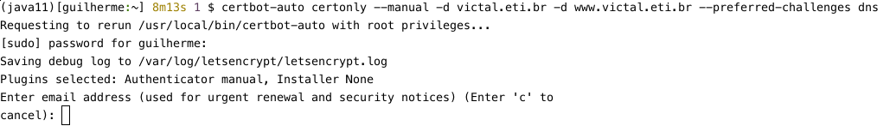

2 - Em seguida, é solicitado o aceite dos termos de serviço do Let's encrypt (disponíveis em https://letsencrypt.org/documents/LE-SA-v1.2-November-15-2017.pdf), do compartilhamento (opcional) do e-mail adicionado anteriormente com a [EFF](https://eff.org), entidade criadora e das principais mantenedoras do Let's Encrypt, e do consentimento ao armazenamento do endereço IP utilizado para geração do certificado (obrigatório).

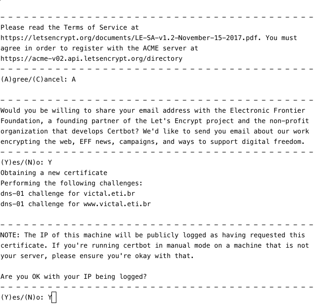

3 - Nesse ponto é fornecido o valor a ser utilizado na entrada DNS com tipo TXT para validação do domínio. A entrada deve ser criada para o hostname `_acme-challenge.[domínio sendo validado]`. Este passo se repete para cada subdomínio passado como parâmetro para o certbot.

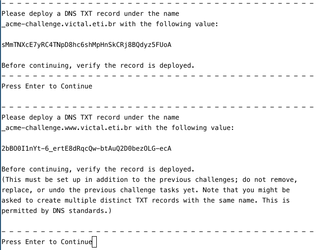

3.5 - Pode-se validar a configuração DNS realizada com `dig TXT _acme-challenge.[domínio]` ou outra ferramenta de consulta DNS
 
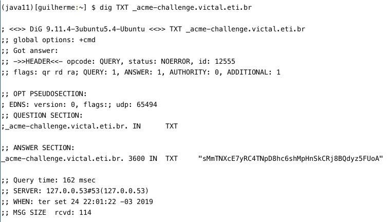

4 - Caso a verificação tenha ocorrido com sucesso, os certificados terão sido criados `/etc/letsencrypt/live/[domínio]` (na prática, com symlinks para `/etc/letsencrypt/archive`). 
Na imagem, os sufixos nos nomes dos arquivos ocorrem por estar re-gerando certificados para o mesmo domínio, que já haviam sido renovados algumas vezes (o certbot guarda o histórico de certificados gerados).

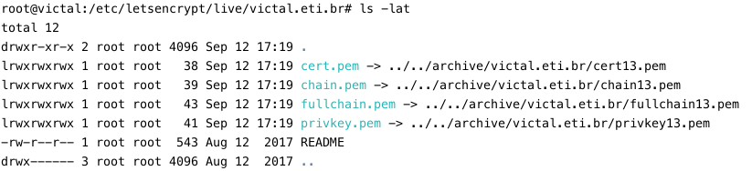

### 5.2 - Configuração do Servidor Web

Após a obtenção dos certificados, a configuração do Servidor Web para utilizá-los é, como se pode esperar, bastante dependente do servidor utilizado (Apache, nginx, IIS ou qualquer outro). 

Configurações diferentes são recomendadas dependendo dos clientes que vão se conectar ao servidor. Por exemplo, quando se deseja suportar clientes mais obsoletos como IE 8 ou apps em versões antigas de Android e iOS, são necessárias configurações com maior compatibilidade; e, em contrapartida, caso se deseje suportar apenas as últimas versões de browsers e SOs é possível utilizar configurações mais restritivas mas mais seguras).

Felizmente, para uma configuração mais rápida do servidor Web desejado pode-se recorrer ao [Gerador de Configuração SSL](https://ssl-config.mozilla.org/#server=apache&server-version=2.4.39&config=intermediate&ocsp=false) da Mozilla, que oferece trechos de configuração para uma série de Servidores Web ou outros serviços, em diferentes graus de compatibilidade.

Para os servidores Web de uso mais comum (Apache e Nginx), a aplicação dos trechos de configuração fornecidos por essa ferramenta pode ser realizada de forma suficientemente direta (aqui exemplificada com a configuração de um servidor Apache com configuração Intermediária:

0 - caso os certificados não tenham sido gerados na mesma máquina em que o servidor web se encontra, copie-os para um diretório no servidor (via SSH, SFTP ou outro protocolo seguro desejado) e certifique-se que apenas o usuário do servidor web (e.g. www-data) tem acesso a este diretório. Como no caso do exemplo acima os certificados foram gerados na própria máquina do servidor, será utilizado o diretório `/etc/letsencrypt/live/victal.eti.br` nos exemplos:

1 - Por via das dúvidas, faça um backup do arquivo de configuração atual do Apache (usualmente dentro de `sites-available` no diretório de configuração do Apache) via, por exemplo:
```
cp /etc/apache2/sites-available/000-default.conf{,.backup}
```

2 - Partindo da configuração atual do Apache para o site acessível via HTTP, e do trecho de configuração gerado pelo gerador da Mozilla:

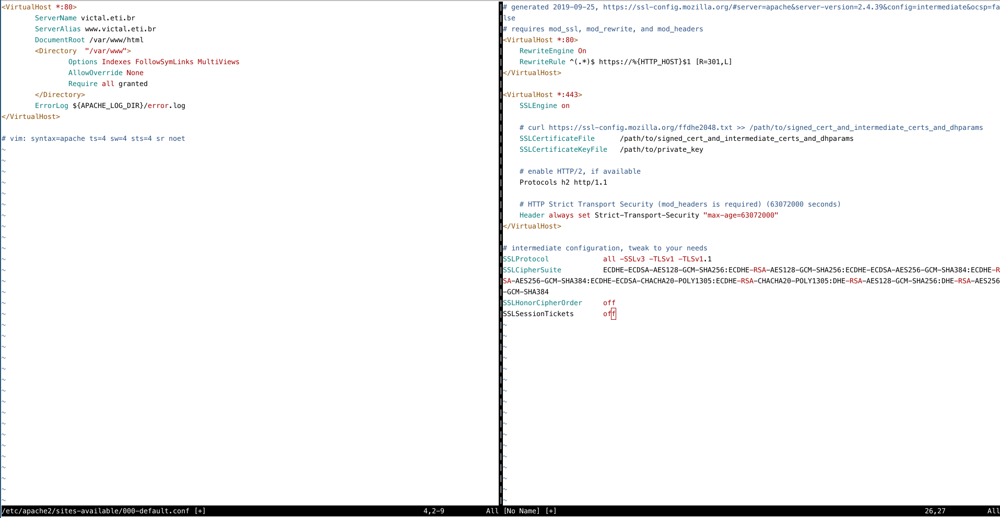

3 - Mova a configuração atual do virtualhost para o virtualhost `*:443` (i.e. utilizando HTTPS) da configuração gerada

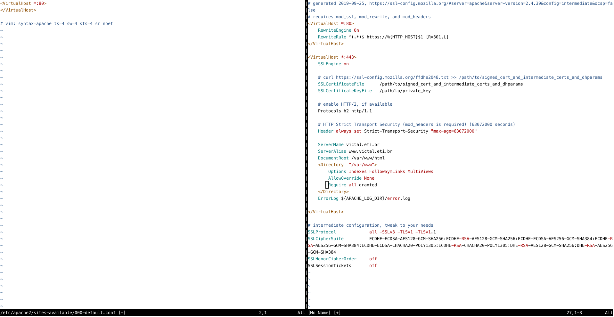

4 - Substitua o conteúdo da configuração atual pela nova configuração com o trecho adicionado no passo anterior, trocando os valores das diretivas `SSLCertificateFile` e `SSLCertificateKeyFile` pelos caminhos para os arquivos `fullchain.pem` e `privkey.pem` do certificado gerado e salve o arquivo

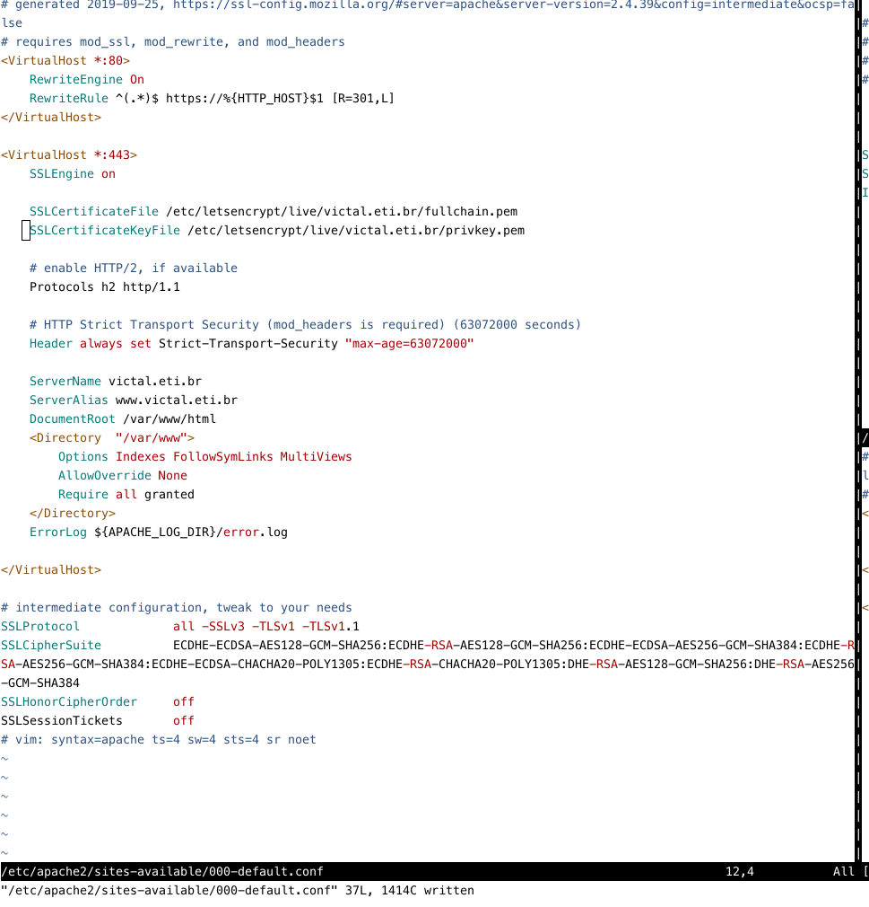

5 - No caso do apache, como pode ser visto no princípio do arquivo de configuração, é necessário habilitar alguns módulos, caso já não estejam habilitados, com:

```
a2enmod ssl rewrite headers
```

6 - Recarregue o servidor apache para que as configurações tenham efeito:

```
service apache2 reload
```

## 6 - Como saber se a configuração HTTPS para um domínio está correta?

O teste mais simples e direto para verificar se a configuração do servidor Web realizada anteriormente está OK é simplesmente acessar o servidor via HTTPS a partir de um browser e verificar se a) o servidor está acessível corretamente e b) os dados do certificado apresentados pelo browser correspondem ao certificado gerado anteriormente, por exemplo, acessando o endereço deste site no Firefox: 

Indicativo no browser de conexão via HTTPS (com certificado válido): 
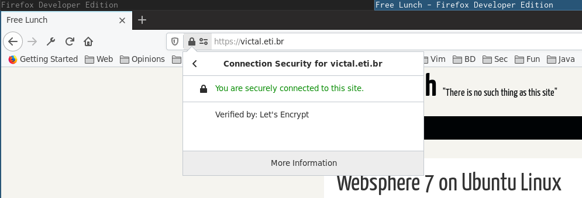

Clicando em 'More Information' e em 'View Certificate' na janela seguinte, é possível verificar mais alguns dados do certificado:

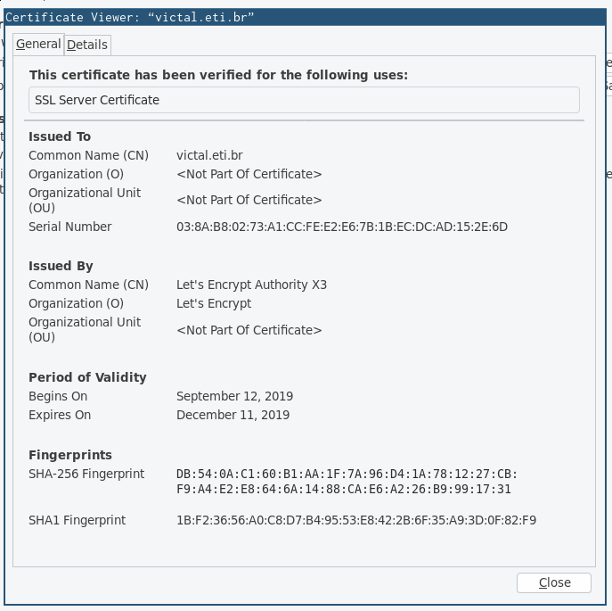

Para validar com mais profundidade a configuração do Servidor Web quanto a HTTPS, uma ferramenta muito útil é o [Qualys SSL Server Test](https://www.ssllabs.com/ssltest/). Além de testar o acesso ao servidor, são verificadas informações como tipos de criptografia permitidos na conexão, versões do protocolo TLS e SSL aceitas pelo servidor, suporte a acesso por diferentes browsers e clientes e suscetibilidade a algumas vulnerabilidades de certas versões e implementações dos protocolos SSL, TLS, e HTTPS, como Heartbleed, POODLE, e DROWN (uma explicação rápida destas vulnerabilidades pode ser encontrada [neste artigo](https://www.security.ufrj.br/tutoriais/servidores-que-utilizam-ssl-vulnerabilidades-e-solucoes/) e nas suas referências).

A configuração padrão fornecida pela ferramenta de configuração da Mozilla, apresentada anteriormente, com o grau de compatibilidade 'Intermediate' costuma ser o suficiente para obter um grau A ou A+ no teste do Qualys, por exemplo:

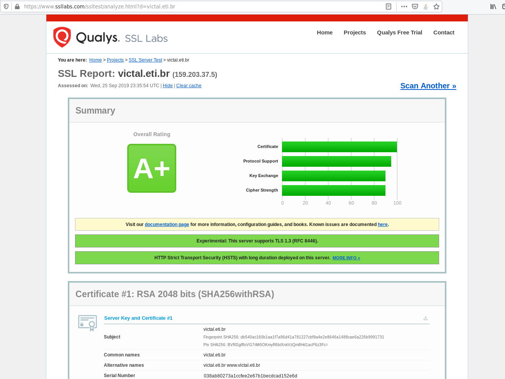

## 7 - O que foi isso que eu acabei de ler? E o que fazer agora? (Próximos passos)

Um problema recorrente para soluções de segurança ubíquas e padrões de mercado, como o HTTPS, é que a discussão pela sua adoção começa e termina em "Vamos utilizar HTTPS!", gerando um uso por [Culto à carga](https://pt.wikipedia.org/wiki/Culto_%C3%A0_carga), que sempre vai gerar problemas quando as circunstâncias em torno dessa solução mudarem (novas vulnerabilidades? novos protocolos? novas formas de criptografia?)
Idealmente, então, este texto deveria ter servido para consolidar estas explicações básicas dos comos e porquês de utilizar HTTPS, e, de quebra, apresentar um roteiro para realizar uma configuração básica de um servidor Web para suportar este protocolo.

A partir deste conhecimento, algumas rotas se abrem para aprofundar o conhecimento do uso e funcionamento interno do HTTPS:
  - Outras questões comuns na configuração de HTTPS, como:
    - Conteúdo misto (mixed content)
    - Tráfego/configuração de cookies e outros dados de autenticação de forma segura
    - Configuração de acesso HTTPS via CDNs (e.g. CLoudflare) quando não é possível configurá-lo direto no servidor

  - Funcionamento mais a fundo do protocolo TLS, como:
    - Quais as versões atualmente existentes de TLS/SSL, no que diferem e quais (não) utilizar?
    - Como o protocolo estabelece uma comunicação segura entre as partes?
    - Quais são os parâmetros de configuração deste protocolo (e.g. as diretivas utilizadas para configurar o servidor Web para HTTPS no exemplo anterior), o que representam e no que influenciam?
    - Quais as diferenças entre os tipos de certificados SSL existentes?

  - Extensões ao protocolo HTTPS, como:
    - HSTS (HTTP Strict Transport Security) 
    - HPKP (HTTP Public Key Pinning)

A maioria destes assuntos será apresentada em maior ou menor grau nos próximos textos sobre este tema, e, para artigos e explicações bem mais amplos sobre o assunto, recomendam-se as seguintes fontes:

 - [Cloudflare Learning](https://www.cloudflare.com/learning/ssl/what-is-ssl/) (em inglês)
 - [Blog](https://www.troyhunt.com/tag/ssl/) do Troy Hunt, pesquisador em segurança da informação e criador do [Have I been Pwned?](https://haveibeenpwned.com/) (em inglês)
 - [Meu site precisa de HTTPS?](https://meusiteprecisadehttps.com.br/)
 - [HTTPS is Easy](https://httpsiseasy.com/) (vídeos em inglês com legenda em português)

[^1]: Para conteúdos mais completos sobre o assunto em inglês, pode-se consultar as referências na última seção do texto.
[^2]: Ou sítio, para os mais literalmente lusófonos
[^3]: "possível" não inclui casos/vulnerabilidades em que é possível quebrar a criptografia utilizada na conexão. Estes casos serão discutidos em momento oportuno.
